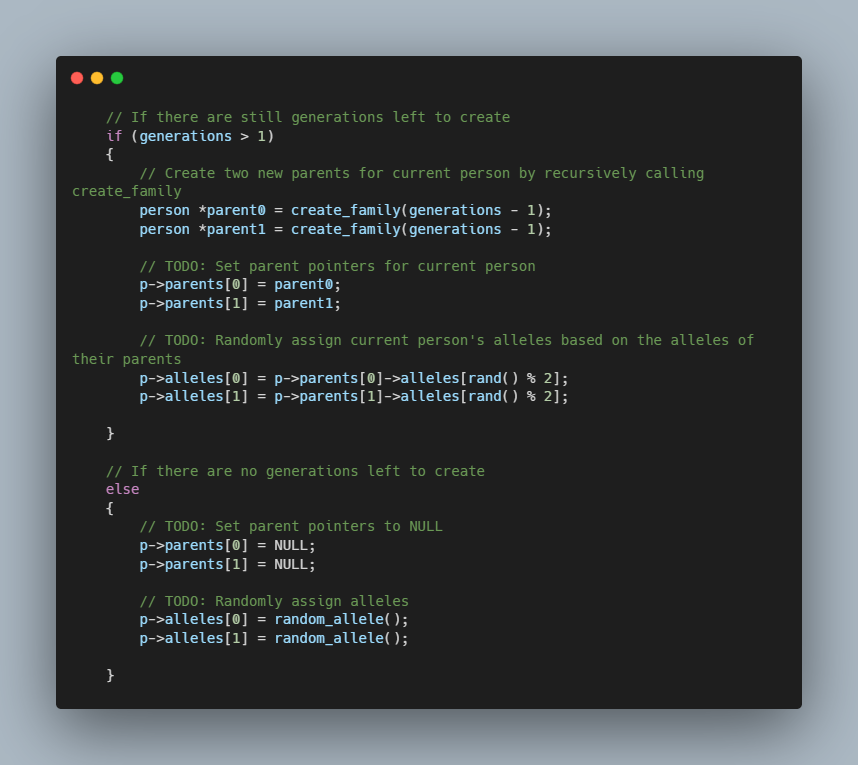

# Inheritance - CS50

### Description

A person’s blood type is determined by two alleles (i.e., different forms of a gene). The three possible alleles are A, B, and O, of which each person has two (possibly the same, possibly different). Each of a child’s parents randomly passes one of their two blood type alleles to their child. The possible blood type combinations, then, are: OO, OA, OB, AO, AA, AB, BO, BA, and BB.

For example, if one parent has blood type AO and the other parent has blood type BB, then the child’s possible blood types would be AB and OB, depending on which allele is received from each parent. Similarly, if one parent has blood type AO and the other OB, then the child’s possible blood types would be AO, OB, AB, and OO.

### How to use

Upon running "./inheritance", your program should adhere to the rules described in the background. The child should have two alleles, one from each parent. The parents should each have two alleles, one from each of their parents.

For example, in the example below, the child in Generation 0 received an O allele from both Generation 1 parents. The first parent received an A from the first grandparent and a O from the second grandparent. Similarly, the second parent received an O and a B from their grandparents.

### Technologies
- C Programming
- Data Structures

### Code Snippet

### Links

[CS50](https://www.edx.org/course/introduction-computer-science-harvardx-cs50x?g_acctid=724-505-4034&g_campaign=gs-b2c-nonbrand-tier1geo-partner-harvard-core&g_campaignid=15417765031&g_adgroupid=131210224478&g_adid=588991333656&g_keyword=harvard%20cs50&g_keywordid=kwd-334019831226&g_network=g&utm_source=google&utm_campaign=gs-b2c-nonbrand-tier1geo-partner-harvard-core&utm_medium=cpc&utm_term=harvard%20cs50&hsa_acc=7245054034&hsa_cam=15417765031&hsa_grp=131210224478&hsa_ad=588991333656&hsa_src=g&hsa_tgt=kwd-334019831226&hsa_kw=harvard%20cs50&hsa_mt=e&hsa_net=adwords&hsa_ver=3&gclid=CjwKCAjwu5yYBhAjEiwAKXk_eJJGOIdTmi-A53VHyQGpzPNd1Gw5MWdUUwFq5cznbZ7IKnl8ctJNthoC8vAQAvD_BwE)